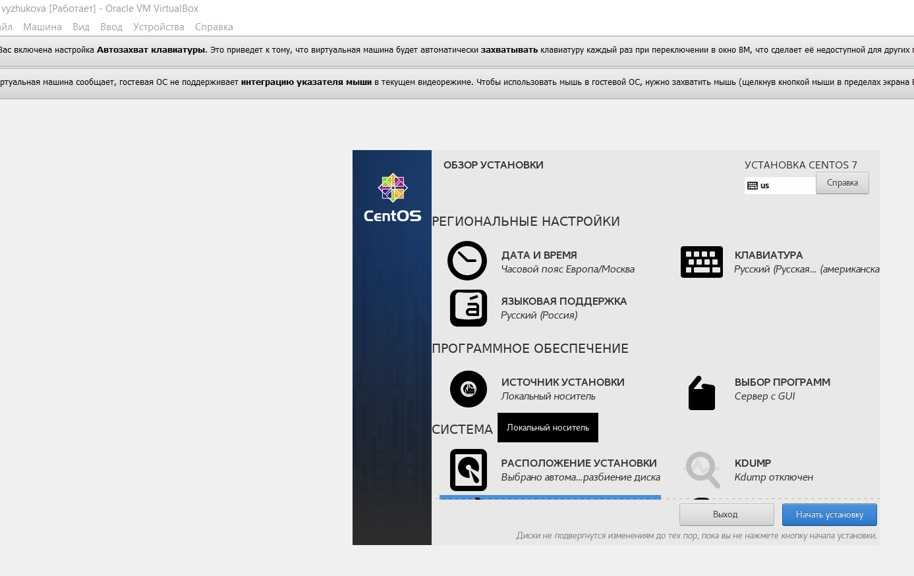

# Работа с виртуальной машиной
###### ФИО: Жукова Виктория Юрьевна

###### Группа: НКНбд-01-19  

###### Студ. билет: 1032196000

---

# Цель выполнения лабораторной работы

1. Приобретение практических навыков установки операционной системы на виртуальную машину;

2. Настройка минимально необходимых для дальнейшей работы сервисов.

---

# Задачи выполнения работы

1. Установить операционную систему Linux (дистрибутив CentOS) на виртуальную машину VirtualBox.

2. Установить дополнения для дальнейшей работы.

---

# Выполнение

- Создала виртуальную машину в VirtualBox

---

# Выполнение

- Настройка виртуальной машины

---

# Выполнение

- Установка операционной системы

---

 Выполнение

- Настройки операционной системы

---

Выполнение

- Конечный результат

---

# Итоги

- Приобрела практические навыки установки операционной системы на виртуальную машину;

- Настроила минимально необходимые для дальнейшей работы сервисы.

###### Спасибо за внимание