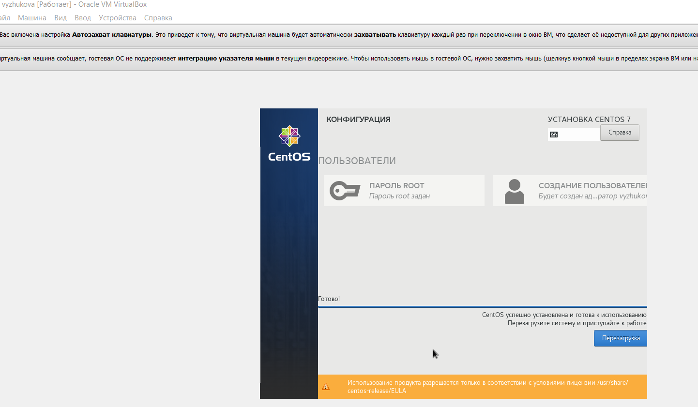

---
# Front matter
lang: ru-RU
title: "Лабораторная работа №1"
subtitle: "Информационная безопасность"
author: "Жукова Виктория Юрьевна"

# Formatting
toc-title: "Содержание"
toc: true # Table of contents
toc_depth: 2
lof: true # List of figures
fontsize: 12pt
linestretch: 1.5
papersize: a4paper
documentclass: scrreprt
polyglossia-lang: russian
polyglossia-otherlangs: english
mainfont: PT Serif
romanfont: PT Serif
sansfont: PT Sans
monofont: PT Mono
mainfontoptions: Ligatures=TeX
romanfontoptions: Ligatures=TeX
sansfontoptions: Ligatures=TeX,Scale=MatchLowercase
monofontoptions: Scale=MatchLowercase
indent: true
pdf-engine: lualatex
header-includes:
  - \linepenalty=10 # the penalty added to the badness of each line within a paragraph (no associated penalty node) Increasing the value makes tex try to have fewer lines in the paragraph.
  - \interlinepenalty=0 # value of the penalty (node) added after each line of a paragraph.
  - \hyphenpenalty=50 # the penalty for line breaking at an automatically inserted hyphen
  - \exhyphenpenalty=50 # the penalty for line breaking at an explicit hyphen
  - \binoppenalty=700 # the penalty for breaking a line at a binary operator
  - \relpenalty=500 # the penalty for breaking a line at a relation
  - \clubpenalty=150 # extra penalty for breaking after first line of a paragraph
  - \widowpenalty=150 # extra penalty for breaking before last line of a paragraph
  - \displaywidowpenalty=50 # extra penalty for breaking before last line before a display math
  - \brokenpenalty=100 # extra penalty for page breaking after a hyphenated line
  - \predisplaypenalty=10000 # penalty for breaking before a display
  - \postdisplaypenalty=0 # penalty for breaking after a display
  - \floatingpenalty = 20000 # penalty for splitting an insertion (can only be split footnote in standard LaTeX)
  - \raggedbottom # or \flushbottom
  - \usepackage{float} # keep figures where there are in the text
  - \floatplacement{figure}{H} # keep figures where there are in the text
---

# Цель работы

1. Приобретение практических навыков установки операционной системы на виртуальную машину;

2. Настройки минимально необходимых для дальнейшей работы сервисов.

# Выполнение лабораторной работы

## Выполнение задания

Для установки на виртуальную машину VirtualBox операционной системы Linux (дистрибутив CentOS) в нашем случае использовалась внешняя операционная система Windows. 

В VirtualBox нажимаем "Машина" - "Создать" и задаем имя "vyzhukova" для нашей будущей операционной системы. Тип - Linux, версия - Red Hat (64-bit).

*Рис. 1. Имя и тип ОС.*

Задаем объем оперативной памяти 2048МБ (Из 16384МБ возможных)

*Рис. 2. Объем памяти.*

Создадим новый динамический виртуальный жесткий диск,

*Рис. 3. Создание виртуального жесткого диска.*

укажем тип VDI,

*Рис. 4. Тип виртуального жесткого диска*

*Рис. 5. Формат хранения*

выделим 40ГБ.

*Рис. 6. Размер виртуального жесткого диска*

Первоначальные основные настройки виртуальной машины заданы, теперь запускаем нашу операционную систему, выбираем образ дистрибутива CentOS. 

*Рис. 7. Образ настройки*

Теперь стали доступны варианты непосредственно установки дистрибутива и продолжение загрузки в тестовом режиме без установки. В дальнейшем нам необходимо будет пользоваться данной операционной системой, устанавливать приложения, сохранять файлы, поэтому выбираем пункт установки.

*Рис. 8. Окно установки CentOS*

Отобразился обзор установки, где мы можем задать настройки уже нашей операционной системы: задать язык раскладки, пароль для суперпользователя, выбрать часовой пояс и другие. 

Выбираем русский язык, указываем ранее созданный виртуальный жесткий диск для системы и нажимаем "Начать установку".

*Рис. 9. Выбираем язык*

*Рис. 10. Обзор установки с настройками ОС*

Отключаем KDUMP.

*Рис. 11. Окно настройки установки: отключение KDUMP*

Выбираем программы.

*Рис. 12. Окно настройки установки: выбор программ*

Настраиваем сеть.

*Рис. 13. Окно настройки установки: сеть и имя узла*

После установки необходимо принять лицензию и  создать пользователя.

*Рис. 14. Установка пароля для пользователя с правами администратора*

Теперь можно завершать установку и переходить в CentOS.

*Рис. 15. Завершение установки ОС*

Осталось установить дополнения гостевой ОС. Для этого в виртуальной машине нажимаем "Устройства" - "Подключить образ диска Дополнений гостевой ОС". После чего запускается установка в терминале. 

*Рис. 16. Установка пакетов*

В итоге получили готовую к использованию операционную систему Linux (дистрибутив CentOS) с установленными дополнениями гостевой ОС, что позволяет менять разрешение экрана, использовать двунаправленный буфер обмена с внешней ОС и др.

*Рис. 17. ОС с установленными дополнениями гостевой ОС*

## Домашнее задание

С помощью команды dmesg | grep -i "то, что ищем" было найдено

1. Версия ядра Linux (Linux version). 

*Рис. 18. Версия ядра Linux*

2. Частота процессора (Detected Mhz processor). 

*Рис. 19. Частота процессора*

3. Модель процессора (CPU0). 

*Рис. 20. Модель процессора*

4. Объем доступной оперативной памяти (Memory available). 

*Рис. 21. Объем доступной оперативной памяти*

5. Тип обнаруженного гипервизора (Hypervisor detected). 

*Рис. 22. Тип обнаруженного гипервизора*

6. Тип файловой системы корневого раздела.

*Рис. 23. Тип файловой системы корневого раздела*

7. Последовательность монтирования файловых систем.

*Рис. 24. Последовательность монтирования файловых систем*

## Контрольные вопросы

1. Какую информацию содержит учётная запись пользователя?

   Идентификатор пользователя (login) и пароль.
2. Укажите команды терминала и приведите примеры:
+ для получения справки по команде;

   man. Например, man bash - справка по команде bash.
+ для перемещения по файловой системе:

   cd. Например, cd /var/tmp.
+ для просмотра содержимого каталога:

   ls. ls -t - для просмотра содержимого, сортированного по дате.
+ для определения объёма каталога:

   du. Например, du -sh для получения читаемого объема.
+ для создания / удаления каталогов / файлов:

   touch - создание файла. touch f1

   rm - удаление файла. rm f1

   mkdir - создание папки. mkdir papka1

   rmdir - удаление папки. mkdir papka1

+ для задания определённых прав на файл / каталог:

   chmod. chmod +x somefile - добавляет разрешение на выполнение для всех пользователей.
+ для просмотра истории команд:

   history. history -n - скопировать команды из файла истории в текущий список.
3. Что такое файловая система? Приведите примеры с краткой характеристикой.

   Файловая система – это инструмент, позволяющий операционной системе и программам обращаться к нужным файлам и работать с ними. 

   Например, FAT – одна из старейших файловых систем, которая была разработана еще в 1977 году программистами компании Microsoft для гибких дисков.

   ReFS – новейшая разработка Microsoft для ОС Windows 8 и Windows 10 Enterprise и Pro для рабочих станций.

   ZFS – файловая система, разработанная для систем хранения данных. Главная ее черта – отказоустойчивость. Данные с которыми ведется работа копируются в служебный сектор. Его объем должен быть равен области хранения.
4. Как посмотреть, какие файловые системы подмонтированы в ОС?

   С помощью команды dmesg | grep -i "filesystem".
5. Как удалить зависший процесс?

   1. Находим PID зависшего процесса.
   2. «Убиваем» процесс командой kill.

# Выводы

1. Приобрела практические навыки установки операционной системы на виртуальную машину;

2. Настроила минимально необходимые для дальнейшей работы сервисы.

# Библиография

1. Кулябов Д. С., Королькова А. В., Геворкян М. Н, [Методические материалы по установке и конфигурации
операционной системы на виртуальную машину](https://esystem.rudn.ru/pluginfile.php/1651744/mod_folder/content/0/001-lab_virtualbox.pdf?forcedownload=1)
2. Кулябов Д. С., Королькова А. В., Геворкян М. Н, [Методические материалы по git](https://esystem.rudn.ru/pluginfile.php/1651744/mod_folder/content/0/002-lab_vcs.pdf?forcedownload=1)
3. Кулябов Д. С., Королькова А. В., Геворкян М. Н, [Методические материалы по virtual box](https://esystem.rudn.ru/pluginfile.php/1651744/mod_folder/content/0/001-lab_virtualbox.pdf?forcedownload=1)