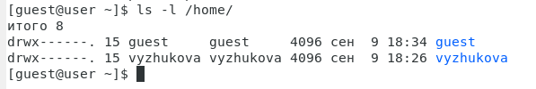

# Дискреционное разграничение прав в Linux. Основные атрибуты

###### ФИО: Жукова Виктория Юрьевна

###### Группа: НКНбд-01-19  

###### Студ. билет: 1032196000

---

# Цель выполнения лабораторной работы

1. Получение практических навыков работы в консоли с атрибутами файлов.

2. Закрепление теоретических основ дискреционного разграничения доступа в современных системах с открытым кодом на базе ОС Linux.

---

# Задачи выполнения работы

1. Создать новую учетную запись

2. Поэксперементировать с атрибутами.

---

# Выполнение

- Создала пользователя guest, задала ему пароль и вошла под ним.
 
 

---

Определила директорию, в которой нахожусь, с помощью команды pwd.

---

Уточним имя пользователя, его группу, а также группы, куда входит пользователь, командой id. Получаем результат 1001.

---

росмотрим файл /etc/passwd командой cat /etc/passwd. 

---

Определим существующие в системе директории командой ls -l /home/. 

---

Проверяем, какие расширенные атрибуты установлены на поддиректориях, находящихся в директории /home, командой: lsattr /home

---

Создадим в домашней директории поддиректорию dir1 командой mkdir dir1

---

Определим командами ls -l и lsattr, какие права доступа и расширенные атрибуты были выставлены на директорию dir1.

---

Снимем с директории dir1 все атрибуты командой chmod 000 dir1 и проверим с её помощью правильность выполнения команды ls -l.

---

Попытаемся создать в директории dir1 файл file1 командой echo "test" > /home/guest/dir1/file1, но получим отказ от выполнения, так как шагом ранее сняли все атрибуты с директории. Проверим, действительно ли файл не создался, с помощью команды ls -l /home/guest/dir1.

---

Заполним таблицу «Установленные права и разрешённые действия».

    | **Права директории** | **Права файла** | **Создание файла** | **Удаление файла** | **Запись в файл** | **Чтение файла** | **Смена директории** | **Просмотр файлов в директории** | **Переименование файла** | **Смена атрибутов файла** |
    | -------------------- | --------------- | ------------------ | ------------------ | ----------------- | ---------------- | -------------------- | -------------------------------- | ------------------------ | ------------------------- |
    | d--------- (000)     | --------- (000) | -                  | -                  | -                 | -                | -                    | -                                | -                        | -                         |
    | d--x------ (100)     | --------- (000) | -                  | -                  | -                 | -                | +                    | -                                | -                        | +                         |
    | d-w------- (200)     | --------- (000) | -                  | -                  | -                 | -                | -                    | -                                | -                        | -                         |
    | d-wx------ (300)     | --------- (000) | +                  | +                  | -                 | -                | +                    | -                                | +                        | +                         |
    | dr-------- (400)     | --------- (000) | -                  | -                  | -                 | -                | -                    | +                                | -                        | -                         |
    | dr-x------ (500)     | --------- (000) | -                  | -                  | -                 | -                | +                    | +                                | -                        | +                         |
    | drw------- (600)     | --------- (000) | -                  | -                  | -                 | -                | -                    | +                                | -                        | -                         |
    | drwx------ (700)     | --------- (000) | +                  | +                  | -                 | -                | +                    | +                                | +                        | +                         |
    | d--------- (000)     | --x------ (100) | -                  | -                  | -                 | -                | -                    | -                                | -                        | -                         |
    | d--x------ (100)     | --x------ (100) | -                  | -                  | -                 | -                | +                    | -                                | -                        | +                         |
    | d-w------- (200)     | --x------ (100) | -                  | -                  | -                 | -                | -                    | -                                | -                        | -                         |
    | d-wx------ (300)     | --x------ (100) | +                  | +                  | -                 | -                | +                    | +                                | +                        | +                         |
    | dr-------- (400)     | --x------ (100) | +                  | -                  | +                 | +                | +                    | -                                | -                        | -                         |
    | dr-x------ (500)     | --x------ (100) | +                  | -                  | -                 | +                | +                    | +                                | +                        | +                         |
    | drw------- (600)     | --x------ (100) | -                  | -                  | -                 | +                | +                    | +                                | +                        | +                         |
    | drwx------ (700)     | --x------ (100) | -                  | -                  | -                 | -                | +                    | -                                | +                        | +                         |
    | d--------- (000)     | -w------- (200) | +                  | +                  | +                 | -                | +                    | +                                | +                        | +                         |
    | d--x------ (100)     | -w------- (200) | +                  | +                  | -                 | -                | +                    | +                                | +                        | +                         |
    | d-w------- (200)     | -w------- (200) | +                  | +                  | -                 | +                | -                    | +                                | +                        | +                         |
    | d-wx------ (300)     | -w------- (200) | -                  | -                  | -                 | -                | +                    | +                                | +                        | +                         |
    | dr-------- (400)     | -w------- (200) | +                  | +                  | +                 | +                | -                    | +                                | -                        | +                         |
    | dr-x------ (500)     | -w------- (200) | +                  | +                  | +                 | -                | +                    | +                                | +                        | +                         |
    | drw------- (600)     | -w------- (200) | +                  | +                  | -                 | +                | -                    | +                                | -                        | +                         |
    | drwx------ (700)     | -w------- (200) | -                  | +                  | +                 | -                | +                    | -                                | +                        | -                         |
    | d--------- (000)     | -wx------ (300) | +                  | +                  | +                 | +                | -                    | -                                | -                        | +                         |
    | d--x------ (100)     | -wx------ (300) | -                  | +                  | -                 | +                | +                    | -                                | +                        | -                         |
    | d-w------- (200)     | -wx------ (300) | +                  | +                  | +                 | +                | +                    | -                                | +                        | +                         |
    | d-wx------ (300)     | -wx------ (300) | -                  | +                  | -                 | +                | -                    | -                                | -                        | -                         |
    | dr-------- (400)     | -wx------ (300) | +                  | -                  | +                 | +                | +                    | +                                | +                        | -                         |
    | dr-x------ (500)     | -wx------ (300) | +                  | -                  | +                 | -                | -                    | +                                | +                        | -                         |
    | drw------- (600)     | -wx------ (300) | +                  | +                  | -                 | +                | +                    | +                                | +                        | +                         |
    | drwx------ (700)     | -wx------ (300) | +                  | +                  | -                 | +                | -                    | +                                | +                        | -                         |
    | d--------- (000)     | r-------- (400) | -                  | -                  | -                 | +                | -                    | +                                | +                        | +                         |
    | d--x------ (100)     | r-------- (400) | +                  | +                  | -                 | -                | -                    | +                                | +                        | -                         |
    | d-w------- (200)     | r-------- (400) | -                  | +                  | +                 | +                | +                    | -                                | +                        | +                         |
    | d-wx------ (300)     | r-------- (400) | +                  | -                  | +                 | +                | -                    | -                                | +                        | -                         |
    | dr-------- (400)     | r-------- (400) | -                  | -                  | +                 | -                | +                    | -                                | +                        | +                         |
    | dr-x------ (500)     | r-------- (400) | +                  | +                  | +                 | +                | +                    | -                                | +                        | -                         |
    | drw------- (600)     | r-------- (400) | +                  | +                  | -                 | -                | +                    | -                                | +                        | -                         |
    | drwx------ (700)     | r-------- (400) | -                  | +                  | +                 | +                | -                    | -                                | +                        | +                         |
    | d--------- (000)     | r-x------ (500) | -                  | -                  | -                 | +                | +                    | -                                | +                        | -                         |
    | d--x------ (100)     | r-x------ (500) | -                  | -                  | -                 | -                | -                    | +                                | +                        | +                         |
    | d-w------- (200)     | r-x------ (500) | -                  | -                  | +                 | -                | -                    | +                                | -                        | -                         |
    | d-wx------ (300)     | r-x------ (500) | -                  | -                  | +                 | +                | -                    | +                                | -                        | +                         |
    | dr-------- (400)     | r-x------ (500) | +                  | -                  | +                 | -                | -                    | -                                | -                        | -                         |
    | dr-x------ (500)     | r-x------ (500) | -                  | +                  | +                 | +                | +                    | -                                | +                        | +                         |
    | drw------- (600)     | r-x------ (500) | -                  | -                  | +                 | -                | +                    | +                                | -                        | -                         |
    | drwx------ (700)     | r-x------ (500) | -                  | +                  | -                 | +                | +                    | -                                | +                        | +                         |
    | d--------- (000)     | rw------- (600) | -                  | -                  | +                 | -                | -                    | +                                | -                        | +                         |
    | d--x------ (100)     | rw------- (600) | +                  | +                  | +                 | +                | -                    | -                                | -                        | +                         |
    | d-w------- (200)     | rw------- (600) | -                  | -                  | -                 | -                | -                    | +                                | -                        | -                         |
    | d-wx------ (300)     | rw------- (600) | +                  | +                  | -                 | +                | -                    | -                                | -                        | +                         |
    | dr-------- (400)     | rw------- (600) | -                  | -                  | -                 | -                | -                    | +                                | +                        | -                         |
    | dr-x------ (500)     | rw------- (600) | +                  | +                  | +                 | +                | -                    | -                                | +                        | +                         |
    | drw------- (600)     | rw------- (600) | -                  | -                  | +                 | +                | -                    | +                                | +                        | -                         |
    | drwx------ (700)     | rw------- (600) | +                  | +                  | +                 | +                | -                    | -                                | +                        | +                         |
    | d--------- (000)     | rwx------ (700) | -                  | -                  | +                 | +                | -                    | +                                | +                        | -                         |
    | d--x------ (100)     | rwx------ (700) | +                  | +                  | +                 | +                | -                    | -                                | -                        | +                         |
    | d-w------- (200)     | rwx------ (700) | +                  | +                  | +                 | -                | -                    | +                                | -                        | -                         |
    | d-wx------ (300)     | rwx------ (700) | +                  | +                  | -                 | -                | -                    | +                                | -                        | +                         |
    | dr-------- (400)     | rwx------ (700) | +                  | -                  | -                 | -                | -                    | -                                | -                        | -                         |
    | dr-x------ (500)     | rwx------ (700) | +                  | -                  | +                 | -                | -                    | -                                | -                        | +                         |
    | drw------- (600)     | rwx------ (700) | -                  | +                  | -                 | -                | -                    | +                                | -                        | -                         |
    | drwx------ (700)     | rwx------ (700) | +                  | +                  | -                 | -                | -                    | -                                | -                        | +                         |

---

    Заполним таблицу «Минимальные права для совершения операций». 

    | Операция               | Минимальные права на директорию | Минимальные права на файл |    
    | ---------------------- | ------------------------------- | ------------------------- |
    | Создание файла         | d-wx------ (300)                | --------- (000)           |
    | Удаление файла         | d-wx------ (300)                | --------- (000)           |
    | Чтение файла           | d--x------ (100)                | r-------- (400)           |
    | Запись в файл          | d--x------ (100)                | -w------- (200)           |
    | Переименование файла   | d-wx------ (300)                | --------- (000)           |
    | Создание поддиректории | d-wx------ (300)                | --------- (000)           |
    | Удаление поддиректории | d-wx------ (300)                | --------- (000)           |

---

# Выводы

Получила практические навыки работы в консоли с атрибутами файлов, закрепила теоретические основы дискреционного разграничения доступа в современных системах с открытым кодом на базе ОС Linux.