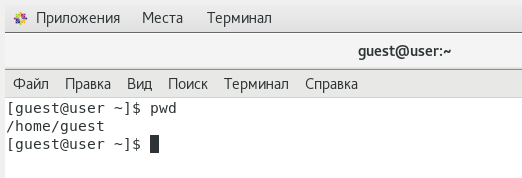
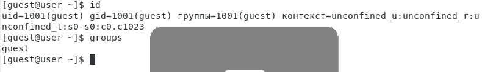

---
# Front matter
lang: ru-RU
title: "Лабораторная работа №2"
subtitle: "Информационная безопасность"
author: "Жукова Виктория Юрьевна"

# Formatting
toc-title: "Содержание"
toc: true # Table of contents
toc_depth: 2
lof: true # List of figures
fontsize: 12pt
linestretch: 1.5
papersize: a4paper
documentclass: scrreprt
polyglossia-lang: russian
polyglossia-otherlangs: english
mainfont: PT Serif
romanfont: PT Serif
sansfont: PT Sans
monofont: PT Mono
mainfontoptions: Ligatures=TeX
romanfontoptions: Ligatures=TeX
sansfontoptions: Ligatures=TeX,Scale=MatchLowercase
monofontoptions: Scale=MatchLowercase
indent: true
pdf-engine: lualatex
header-includes:
  - \linepenalty=10 # the penalty added to the badness of each line within a paragraph (no associated penalty node) Increasing the value makes tex try to have fewer lines in the paragraph.
  - \interlinepenalty=0 # value of the penalty (node) added after each line of a paragraph.
  - \hyphenpenalty=50 # the penalty for line breaking at an automatically inserted hyphen
  - \exhyphenpenalty=50 # the penalty for line breaking at an explicit hyphen
  - \binoppenalty=700 # the penalty for breaking a line at a binary operator
  - \relpenalty=500 # the penalty for breaking a line at a relation
  - \clubpenalty=150 # extra penalty for breaking after first line of a paragraph
  - \widowpenalty=150 # extra penalty for breaking before last line of a paragraph
  - \displaywidowpenalty=50 # extra penalty for breaking before last line before a display math
  - \brokenpenalty=100 # extra penalty for page breaking after a hyphenated line
  - \predisplaypenalty=10000 # penalty for breaking before a display
  - \postdisplaypenalty=0 # penalty for breaking after a display
  - \floatingpenalty = 20000 # penalty for splitting an insertion (can only be split footnote in standard LaTeX)
  - \raggedbottom # or \flushbottom
  - \usepackage{float} # keep figures where there are in the text
  - \floatplacement{figure}{H} # keep figures where there are in the text
---

# Цель работы

1. Получение практических навыков работы в консоли с атрибутами файлов.

2. Закрепление теоретических основ дискреционного разграничения доступа в современных системах с открытым кодом на базе ОС Linux.

# Выполнение лабораторной работы

## Выполнение задания

Создаём новую учётную запись guest, используя команду useradd guest

Рис. 1. Создание учётной записи

После этого зададим пароль с помощью команды passwd guest, используя учетную запись администратора.

Рис. 2. Установка пароля

Входим в систему от имени пользователя guest 

Рис. 3. Вход в систему

и определяем директорию, в которой находимся, с помощью команды pwd.

Рис. 4. Определение директории

Сравнивая с приглашением командной строки, определяем сходство и факт, что это наша домашнаяя директория. 

Командой whoami уточняем имя пользователя - guest.

Рис. 5. Уточнение имени пользователя

Уточним имя пользователя, его группу, а также группы, куда входит пользователь, командой id. Получаем результат 1001.

Рис. 6. Уточняем имя и атрибуты

Далее сравним вывод id c приглашением командной строки, обнаружим, что имя пользователя повторяется. 

Просмотрим файл /etc/passwd командой cat /etc/passwd. 

Рис. 7. Просматр файла /etc/passwd

Найдём в нём свою учётную запись. Определим uid пользователя = 1001. Определим gid пользователя = 1001. Сравним найденные значения с полученными в предыдущих пунктах - они одинаковые.

Определим существующие в системе директории командой ls -l /home/. 

Рис. 8. Определение существующих директорий

Нам удалось получить список поддиректорий. У каждой из них установлены права на чтение, запись и выполнение только для самого пользователя.

Проверяем, какие расширенные атрибуты установлены на поддиректориях, находящихся в директории /home, командой: lsattr /home

Рис. 9. Проверка атрибутов

Нам удалось увидеть расширенные атрибуты директории, но не удалось увидеть расширенные атрибуты директорий других пользователей.

Создадим в домашней директории поддиректорию dir1 командой mkdir dir1

Рис. 10. Создание поддиректории dir1

Определим командами ls -l и lsattr, какие права доступа и расширенные атрибуты были выставлены на директорию dir1.

Рис. 11. Определение прав доступа и расширенных атрибутов

Снимем с директории dir1 все атрибуты командой chmod 000 dir1 и проверим с её помощью правильность выполнения команды ls -l.

Рис. 12. Снятие аттрибутов

Попытаемся создать в директории dir1 файл file1 командой echo "test" > /home/guest/dir1/file1, но получим отказ от выполнения, так как шагом ранее сняли все атрибуты с директории. Проверим, действительно ли файл не создался, с помощью команды ls -l /home/guest/dir1.

Рис. 13. Попытка создать файл.

Заполним таблицу «Установленные права и разрешённые действия».

| **Права директории** | **Права файла** | **Создание файла** | **Удаление файла** | **Запись в файл** | **Чтение файла** | **Смена директории** |**Просмотр файлов в директории** | **Переименование файла** | **Сменаатрибутов файла** |
| -------------------- | --------------- | ------------------ |------------------ | ----------------- | ---------------- |-------------------- | -------------------------------- |------------------------ | ------------------------- |
| d--------- (000)     | --------- (000) | -                  |-                  | -                 | -                |-                    | -                                |-                        | -                         |
| d--x------ (100)     | --------- (000) | -                  |-                  | -                 | -                |+                    | -                                |-                        | +                         |
| d-w------- (200)     | --------- (000) | -                  |-                  | -                 | -                |-                    | -                                |-                        | -                         |
| d-wx------ (300)     | --------- (000) | +                  |+                  | -                 | -                |+                    | -                                |+                        | +                         |
| dr-------- (400)     | --------- (000) | -                  |-                  | -                 | -                |-                    | +                                |-                        | -                         |
| dr-x------ (500)     | --------- (000) | -                  |-                  | -                 | -                |+                    | +                                |-                        | +                         |
| drw------- (600)     | --------- (000) | -                  |-                  | -                 | -                |-                    | +                                |-                        | -                         |
| drwx------ (700)     | --------- (000) | +                  |+                  | -                 | -                |+                    | +                                |+                        | +                         |
| d--------- (000)     | --x------ (100) | -                  |-                  | -                 | -                |-                    | -                                |-                        | -                         |
| d--x------ (100)     | --x------ (100) | -                  |-                  | -                 | -                |+                    | -                                |-                        | +                         |
| d-w------- (200)     | --x------ (100) | -                  |-                  | -                 | -                |-                    | -                                |-                        | -                         |
| d-wx------ (300)     | --x------ (100) | +                  |+                  | -                 | -                |+                    | +                                |+                        | +                         |
| dr-------- (400)     | --x------ (100) | +                  |-                  | +                 | +                |+                    | -                                |-                        | -                         |
| dr-x------ (500)     | --x------ (100) | +                  |-                  | -                 | +                |+                    | +                                |+                        | +                         |
| drw------- (600)     | --x------ (100) | -                  |-                  | -                 | +                |+                    | +                                |+                        | +                         |
| drwx------ (700)     | --x------ (100) | -                  |-                  | -                 | -                |+                    | -                                |+                        | +                         |
| d--------- (000)     | -w------- (200) | +                  |+                  | +                 | -                |+                    | +                                |+                        | +                         |
| d--x------ (100)     | -w------- (200) | +                  |+                  | -                 | -                |+                    | +                                |+                        | +                         |
| d-w------- (200)     | -w------- (200) | +                  |+                  | -                 | +                |-                    | +                                |+                        | +                         |
| d-wx------ (300)     | -w------- (200) | -                  |-                  | -                 | -                |+                    | +                                |+                        | +                         |
| dr-------- (400)     | -w------- (200) | +                  |+                  | +                 | +                |-                    | +                                |-                        | +                         |
| dr-x------ (500)     | -w------- (200) | +                  |+                  | +                 | -                |+                    | +                                |+                        | +                         |
| drw------- (600)     | -w------- (200) | +                  |+                  | -                 | +                |-                    | +                                |-                        | +                         |
| drwx------ (700)     | -w------- (200) | -                  |+                  | +                 | -                |+                    | -                                |+                        | -                         |
| d--------- (000)     | -wx------ (300) | +                  |+                  | +                 | +                |-                    | -                                |-                        | +                         |
| d--x------ (100)     | -wx------ (300) | -                  |+                  | -                 | +                |+                    | -                                |+                        | -                         |
| d-w------- (200)     | -wx------ (300) | +                  |+                  | +                 | +                |+                    | -                                |+                        | +                         |
| d-wx------ (300)     | -wx------ (300) | -                  |+                  | -                 | +                |-                    | -                                |-                        | -                         |
| dr-------- (400)     | -wx------ (300) | +                  |-                  | +                 | +                |+                    | +                                |+                        | -                         |
| dr-x------ (500)     | -wx------ (300) | +                  |-                  | +                 | -                |-                    | +                                |+                        | -                         |
| drw------- (600)     | -wx------ (300) | +                  |+                  | -                 | +                |+                    | +                                |+                        | +                         |
| drwx------ (700)     | -wx------ (300) | +                  |+                  | -                 | +                |-                    | +                                |+                        | -                         |
| d--------- (000)     | r-------- (400) | -                  |-                  | -                 | +                |-                    | +                                |+                        | +                         |
| d--x------ (100)     | r-------- (400) | +                  |+                  | -                 | -                |-                    | +                                |+                        | -                         |
| d-w------- (200)     | r-------- (400) | -                  |+                  | +                 | +                |+                    | -                                |+                        | +                         |
| d-wx------ (300)     | r-------- (400) | +                  |-                  | +                 | +                |-                    | -                                |+                        | -                         |
| dr-------- (400)     | r-------- (400) | -                  |-                  | +                 | -                |+                    | -                                |+                        | +                         |
| dr-x------ (500)     | r-------- (400) | +                  |+                  | +                 | +                |+                    | -                                |+                        | -                         |
| drw------- (600)     | r-------- (400) | +                  |+                  | -                 | -                |+                    | -                                |+                        | -                         |
| drwx------ (700)     | r-------- (400) | -                  |+                  | +                 | +                |-                    | -                                |+                        | +                         |
| d--------- (000)     | r-x------ (500) | -                  |-                  | -                 | +                |+                    | -                                |+                        | -                         |
| d--x------ (100)     | r-x------ (500) | -                  |-                  | -                 | -                |-                    | +                                |+                        | +                         |
| d-w------- (200)     | r-x------ (500) | -                  |-                  | +                 | -                |-                    | +                                |-                        | -                         |
| d-wx------ (300)     | r-x------ (500) | -                  |-                  | +                 | +                |-                    | +                                |-                        | +                         |
| dr-------- (400)     | r-x------ (500) | +                  |-                  | +                 | -                |-                    | -                                |-                        | -                         |
| dr-x------ (500)     | r-x------ (500) | -                  |+                  | +                 | +                |+                    | -                                |+                        | +                         |
| drw------- (600)     | r-x------ (500) | -                  |-                  | +                 | -                |+                    | +                                |-                        | -                         |
| drwx------ (700)     | r-x------ (500) | -                  |+                  | -                 | +                |+                    | -                                |+                        | +                         |
| d--------- (000)     | rw------- (600) | -                  |-                  | +                 | -                |-                    | +                                |-                        | +                         |
| d--x------ (100)     | rw------- (600) | +                  |+                  | +                 | +                |-                    | -                                |-                        | +                         |
| d-w------- (200)     | rw------- (600) | -                  |-                  | -                 | -                |-                    | +                                |-                        | -                         |
| d-wx------ (300)     | rw------- (600) | +                  |+                  | -                 | +                |-                    | -                                |-                        | +                         |
| dr-------- (400)     | rw------- (600) | -                  |-                  | -                 | -                |-                    | +                                |+                        | -                         |
| dr-x------ (500)     | rw------- (600) | +                  |+                  | +                 | +                |-                    | -                                |+                        | +                         |
| drw------- (600)     | rw------- (600) | -                  |-                  | +                 | +                |-                    | +                                |+                        | -                         |
| drwx------ (700)     | rw------- (600) | +                  |+                  | +                 | +                |-                    | -                                |+                        | +                         |
| d--------- (000)     | rwx------ (700) | -                  |-                  | +                 | +                |-                    | +                                |+                        | -                         |
| d--x------ (100)     | rwx------ (700) | +                  |+                  | +                 | +                |-                    | -                                |-                        | +                         |
| d-w------- (200)     | rwx------ (700) | +                  |+                  | +                 | -                |-                    | +                                |-                        | -                         |
| d-wx------ (300)     | rwx------ (700) | +                  |+                  | -                 | -                |-                    | +                                |-                        | +                         |
| dr-------- (400)     | rwx------ (700) | +                  |-                  | -                 | -                |-                    | -                                |-                        | -                         |
| dr-x------ (500)     | rwx------ (700) | -                 |-                  | +                 | +               |-                    | +                               |-                        | +                         |
| drw------- (600)     | rwx------ (700) | -                  |+                  | -                 | -                |-                    | +                                |-                        | -                         |
| drwx------ (700)     | rwx------ (700) | +                  |+                  | +                | +               |+                    | +                               |+                        | +                         |

Заполним таблицу «Минимальные права для совершения операций». 

| Операция               | Минимальные права на директорию | Минимальные права на файл |    
| ---------------------- | ------------------------------- | ------------------------- |
| Создание файла         | d-wx------ (300)                | --------- (000)           |
| Удаление файла         | d-wx------ (300)                | --------- (000)           |
| Чтение файла           | d--x------ (100)                | r-------- (400)           |
| Запись в файл          | d--x------ (100)                | -w------- (200)           |
| Переименование файла   | d-wx------ (300)                | --------- (000)           |
| Создание поддиректории | d-wx------ (300)                | --------- (000)           |
| Удаление поддиректории | d-wx------ (300)                | --------- (000)           |

# Выводы

Получила практические навыки работы в консоли с атрибутами файлов, закрепила теоретические основы дискреционного разграничения доступа в современных системах с открытым кодом на базе ОС Linux.

# Список литературы

- <code>[Кулябов Д. С., Королькова А. В., Геворкян М. Н Лабораторная работа №2](https://esystem.rudn.ru/pluginfile.php/1651747/mod_resource/content/6/002-lab_discret_attr.pdf)</code>