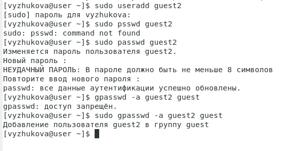
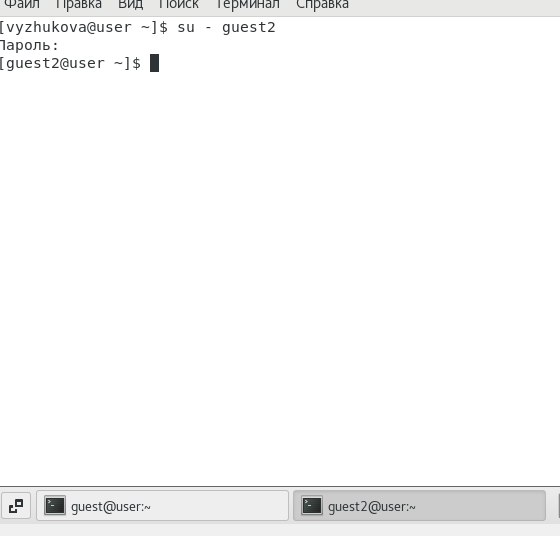
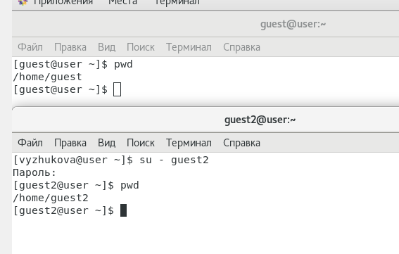
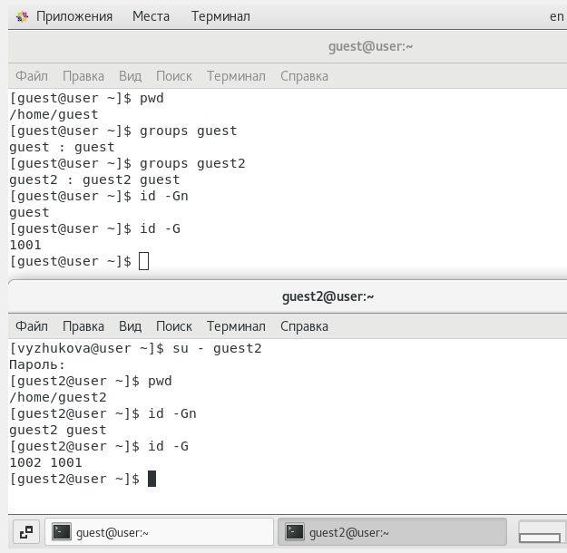
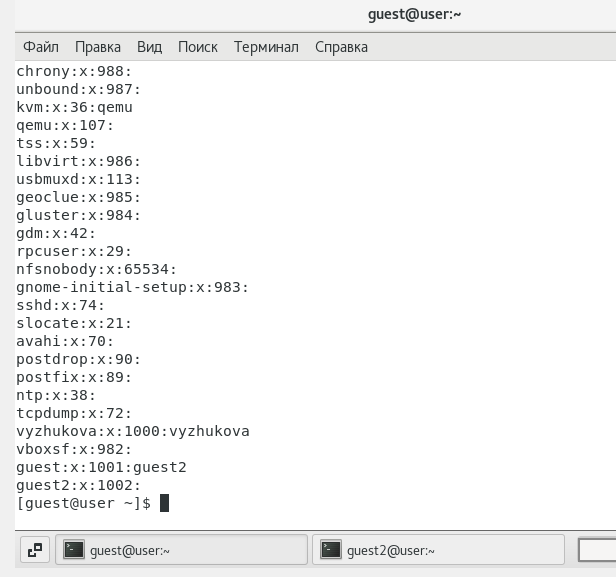
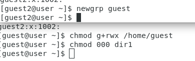
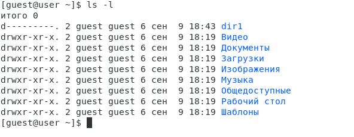

# Дискреционное разграничение прав в Linux. Два пользователя

###### ФИО: Жукова Виктория Юрьевна

###### Группа: НКНбд-01-19  

###### Студ. билет: 1032196000

---

# Цель выполнения лабораторной работы

Получение практических навыков работы в консоли с атрибутами файлов для групп пользователей.

---

# Задачи выполнения работы

1. Создать новую учетную запись

2. Поэксперементировать с атрибутами у двух пользователей.

---

# Выполнение



---

- Выполнили вход в две учетные записи guest guest2 на разных консолях



---

- Для обоих пользователей командой Pwd определили директорию, в которой находимся.



---

{ #fig:002 width=70% height=70% }

---

- Сравнили полученную информацию с содержимым файла /etc/group. Посмотрели файл командой cat /etc/group.



---



---

{ #fig:004 width=70% height=70% }

---

Установленные права и разрешённые действия для групп

|   Права директории   |      Права файла     | Создание файла | Удаление файла | Запись в файл | Чтение файла | Смена директории | Просмотр файлов в директории | Переименование файл | Смена атрибутов файла |
|:---------------------|:---------------------|-----|-----|-----|-----|-----|-----|-----|-----|
|```d--------- (000)```|```---------- (000)```|  -	|  -  |  -  |  -  |  -	|  -  |  -  |  -  |
|```d-----x--- (010)```|```---------- (000)```|  -	|  -  |	 -	|  -  |  +  |  -  |  -  |  +  |
|```d----w---- (020)```|```---------- (000)```|  -	|  -  |	 -  |  -  |  -	|  -  |  -  |  -  |
|```d----wx--- (030)```|```---------- (000)```|  +	|  +  |  -	|  -  |  +  |  -  |  +  |  +  |
|```d---r----- (040)```|```---------- (000)```|  -	|  -  |	 -  |  -  |  -	|  +  |  -  |  -  |
|```d---r-x--- (050)```|```---------- (000)```|  -	|  -  |  -	|  -  |  +  |  +  |  -  |  +  |
|```d---rw---- (060)```|```---------- (000)```|  -	|  -  |  -  |  -  |  -	|  +  |  -  |  -  |
|```d---rwx--- (070)```|```---------- (000)```|  +	|  +  |	 -	|  -  |  +	|  +  |  +  |  +  |
|```d--------- (000)```|```------x--- (010)```|  -	|  -  |  -  |  -  |  -	|  -  |  -  |  -  |
|```d-----x--- (010)```|```------x--- (010)```|  -  |  -  |	 -	|  -  |  +	|  -  |  -  |  +  |
|```d----w---- (020)```|```------x--- (010)```|  -	|  -  |  -  |  -  |  -	|  -  |  -  |  -  |
|```d----wx--- (030)```|```------x--- (010)```|  +	|  +  |	 -	|  -  |  +	|  -  |  +  |  +  |
|```d---r----- (040)```|```------x--- (010)```|  -	|  -  |  -  |  -  |  -	|  +  |  -  |  -  |
|```d---r-x--- (050)```|```------x--- (010)```|  -	|  -  |	 -	|  -  |  +	|  +  |  -  |  +  |
|```d---rw---- (060)```|```------x--- (010)```|  -	|  -  |  -  |  -  |  -	|  +  |  -  |  -  |
|```d---rwx--- (070)```|```------x--- (010)```|  +	|  +  |	 -	|  -  |  +	|  +  |  +  |  +  |
|```d--------- (000)```|```-----w---- (020)```|  -	|  -  |  -  |  -  |  -	|  -  |  -  |  -  |
|```d-----x--- (010)```|```-----w---- (020)```|  -	|  -  |	 +	|  -  |  +	|  -  |  -  |  +  |
|```d----w---- (020)```|```-----w---- (020)```|  -	|  -  |  -  |  -  |  -	|  -  |  -  |  -  |
|```d----wx--- (030)```|```-----w---- (020)```|  +	|  +  |	 +	|  -  |  +	|  -  |  +  |  +  |
|```d---r----- (040)```|```-----w---- (020)```|  -	|  -  |  -  |  -  |  -	|  +  |  -  |  -  |
|```d---r-x--- (050)```|```-----w---- (020)```|  -	|  -  |	 +  |  -  |  +	|  +  |  -  |  +  |
|```d---rw---- (060)```|```-----w---- (020)```|  -	|  -  |  -  |  -  |  -	|  +  |  -  |  -  |
|```d---rwx--- (070)```|```-----w---- (020)```|  +	|  +  |	 +	|  -  |  +	|  +  |  +  |  +  |
|```d--------- (000)```|```-----wx--- (030)```|  -	|  -  |  -  |  -  |  -	|  -  |  -  |  -  |
|```d-----x--- (010)```|```-----wx--- (030)```|  -	|  -  |	 +	|  -  |  +	|  -  |  -  |  +  |
|```d----w---- (020)```|```-----wx--- (030)```|  -	|  -  |  -  |  -  |  -	|  -  |  -  |  -  |
|```d----wx--- (030)```|```-----wx--- (030)```|  +  |  +  |	 +  |  -  |  +  |  -  |  +  |  +  |
|```d---r----- (040)```|```-----wx--- (030)```|  -	|  -  |  -  |  -  |  -	|  +  |  -  |  -  |
|```d---r-x--- (050)```|```-----wx--- (030)```|  -  |  -  |	 +	|  -  |  +	|  +  |  -  |  +  |
|```d---rw---- (060)```|```-----wx--- (030)```|  -	|  -  |  -  |  -  |  -	|  +  |  -  |  -  |
|```d---rwx--- (070)```|```-----wx--- (030)```|  +	|  +  |	 +	|  -  |  +	|  +  |  +  |  +  |
|```d--------- (000)```|```----r----- (040)```|  -	|  -  |  -  |  -  |  -	|  -  |  -  |  -  |
|```d-----x--- (010)```|```----r----- (040)```|  -	|  -  |	 -	|  +  |  +	|  -  |  -  |  +  |
|```d----w---- (020)```|```----r----- (040)```|  -	|  -  |  -  |  -  |  -	|  -  |  -  |  -  |
|```d----wx--- (030)```|```----r----- (040)```|  +	|  +  |	 -	|  +  |  +	|  -  |  +  |  +  |
|```d---r----- (040)```|```----r----- (040)```|  -	|  -  |  -  |  -  |  -	|  +  |  -  |  -  |
|```d---r-x--- (050)```|```----r----- (040)```|  -  |  -  |	 -	|  +  |  +  |  +  |  -  |  +  |
|```d---rw---- (060)```|```----r----- (040)```|  -	|  -  |  -  |  -  |  -	|  +  |  -  |  -  |
|```d---rwx--- (070)```|```----r----- (040)```|  +	|  +  |	 -	|  +  |  +	|  +  |  +  |  +  |
|```d--------- (000)```|```----r-x--- (050)```|  -	|  -  |  -  |  -  |  -	|  -  |  -  |  -  |
|```d-----x--- (010)```|```----r-x--- (050)```|  -	|  -  |	 -	|  +  |  +	|  -  |  -  |  +  |
|```d----w---- (020)```|```----r-x--- (050)```|  -	|  -  |  -  |  -  |  -	|  -  |  -  |  -  |
|```d----wx--- (030)```|```----r-x--- (050)```|  +	|  +  |	 -  |  +  |  +	|  -  |  +  |  +  |
|```d---r----- (040)```|```----r-x--- (050)```|  -	|  -  |  -  |  -  |  -	|  +  |  -  |  -  |
|```d---r-x--- (050)```|```----r-x--- (050)```|  -	|  -  |	 -	|  +  |  +	|  +  |  -  |  +  |
|```d---rw---- (060)```|```----r-x--- (050)```|  -	|  -  |  -  |  -  |  -	|  +  |  -  |  -  |
|```d---rwx--- (070)```|```----r-x--- (050)```|  +	|  +  |	 -	|  +  |  +	|  +  |  +  |  +  |
|```d--------- (000)```|```----rw---- (060)```|  -	|  -  |  -  |  -  |  -	|  -  |  -  |  -  |
|```d-----x--- (010)```|```----rw---- (060)```|  -	|  -  |  +	|  +  |  +	|  -  |  -  |  +  |
|```d----w---- (020)```|```----rw---- (060)```|  -	|  -  |  -  |  -  |  -	|  -  |  -  |  -  |
|```d----wx--- (030)```|```----rw---- (060)```|  +	|  +  |	 +	|  +  |  +	|  -  |  +  |  +  |
|```d---r----- (040)```|```----rw---- (060)```|  -	|  -  |  -  |  -  |  -	|  +  |  -  |  -  |
|```d---r-x--- (050)```|```----rw---- (060)```|  -  |  -  |	 +	|  +  |  +	|  +  |  -  |  +  |
|```d---rw---- (060)```|```----rw---- (060)```|  -	|  -  |  -  |  -  |  -	|  +  |  -  |  -  |
|```d---rwx--- (070)```|```----rw---- (060)```|  +  |  +  |	 +	|  +  |  +	|  +  |  +  |  +  |
|```d--------- (000)```|```----rwx--- (070)```|  -	|  -  |  -  |  -  |  -	|  -  |  -  |  -  |
|```d-----x--- (010)```|```----rwx--- (070)```|  -  |  -  |	 +	|  +  |  +	|  -  |  -  |  +  |
|```d----w---- (020)```|```----rwx--- (070)```|  -	|  -  |  -  |  -  |  -	|  -  |  -  |  -  |
|```d----wx--- (030)```|```----rwx--- (070)```|  +  |  +  |	 +	|  +  |  +	|  -  |  +  |  +  |
|```d---r----- (040)```|```----rwx--- (070)```|  -	|  -  |  -  |  -  |  -	|  +  |  -  |  -  |
|```d---r-x--- (050)```|```----rwx--- (070)```|  -  |  -  |	 +	|  +  |  +	|  +  |  -  |  +  |
|```d---rw---- (060)```|```----rwx--- (070)```|  -	|  -  |  -  |  -  |  -	|  +  |  -  |  -  |
|```d---rwx--- (070)```|```----rwx--- (070)```|  +  |  +  |	 +	|  +  |  +	|  +  |  +  |  +  |

---

Минимальные права для совершения операций 

|        Операция        | права на директорию | права на файл |
|------------------------|---------------------------------|---------------------------|
|     Создание файла     |           ```d----wx--- (030)```      |      ```---------- (000)```     |	    
|     Удаление файла     |           ```d----wx--- (030)```      |      ```---------- (000)```     |
|      Чтение файла      |           ```d-----x--- (010)```      |      ```----r----- (040)```     |
|      Запись в файл     |           ```d-----x--- (010)```      |      ```-----w---- (020)```     |
|  Переименование файла  |           ```d----wx--- (030)```      |      ```---------- (000)```     |
| Создание поддиректории |           ```d----wx--- (030)```      |      ```---------- (000)```     |
| Удаление поддиректории |           ```d----wx--- (030)```      |      ```---------- (000)```     |

---

# Вывод

В ходе выполнения работы, мы смогли приобрести практические навыки работы в консоли с атрибутами файлов для групп пользователей.