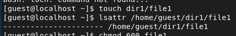
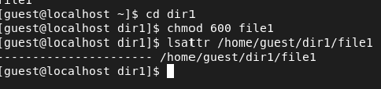
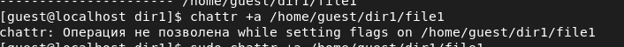
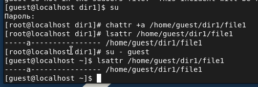
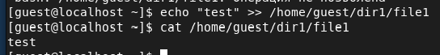
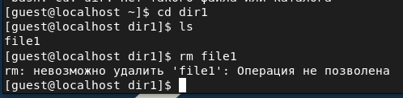
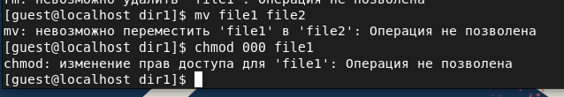
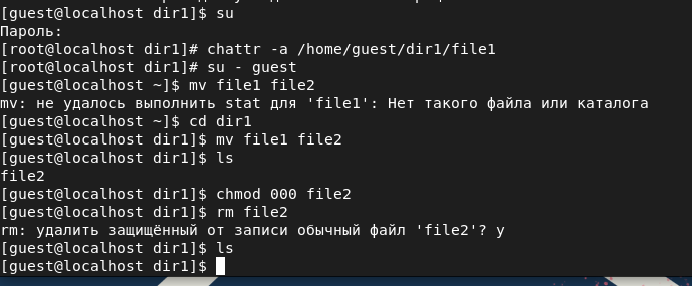
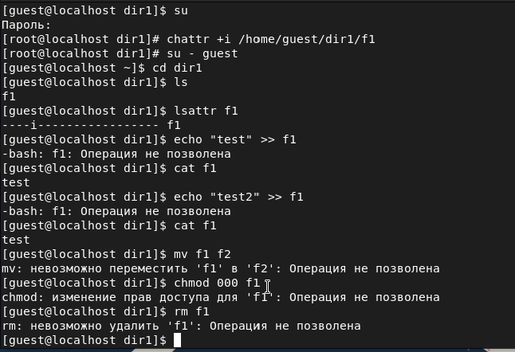

# Дискреционное разграничение прав в Linux. Расширенные атрибуты

###### ФИО: Жукова Виктория Юрьевна

###### Группа: НКНбд-01-19  

###### Студ. билет: 1032196000

---

# Цель выполнения лабораторной работы

Получение практических навыков работы в консоли с расширенными атрибутами файлов.

---

# Задача выполнения работы

Поэксперементировать с расширенными атрибутами.

---

# Выполнение

---

# Выполнение

​Выполнить операции не удалось.

---

# Выполнение

Снимаю расширенный атрибут a с файла

​		Таким образом, можно сделать вывод, что атрибут «а» позволяет добавлять
​		информацию в файл, но удалять ее, переименовывать файл или менять права доступа	к нему нельзя. Атрибут может быть установлен только суперпользователем.

---

# Выполнение

Повтор действий выше, но с атрибутом i

​

---

Таким образом, можно сделать вывод, что атрибут «i» указывает на то, что
нельзя изменять название файла, его содержимое и права доступа. Установить атрибут может только суперпользователь.

---

### Вывод

В ходе данной лабораторной работы мы получили практические навыки работы в консоли с атрибутами файлов для групп пользователей.

