# Дискреционное разграничение прав в Linux. Исследование влияния дополнительных атрибутов

###### ФИО: Жукова Виктория Юрьевна

###### Группа: НКНбд-01-19  

###### Студ. билет: 1032196000

---

# Цель выполнения лабораторной работы

Изучение механизмов изменения идентификаторов, применения SetUID- и Sticky-битов. Получение практических навыков работы в консоли с дополнительными атрибутами. Рассмотрение работы механизма смены идентификатора процессов пользователей, а также влияние бита Sticky на запись и удаление файлов.

---

# Задачи выполнения работы

1. Поработать с компиляцией си программ.

2. Поэксперементировать со Sticky-битом.

---

# Выполнение

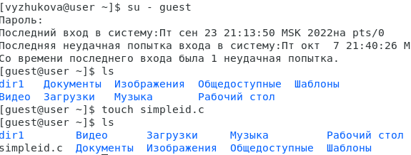

---

# Выполнение

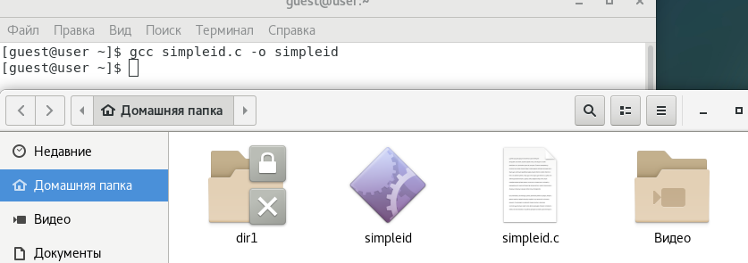
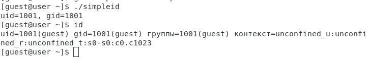

---

# Выполнение

---

# Выполнение

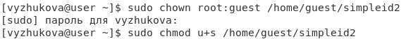
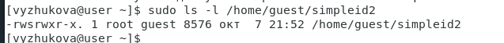
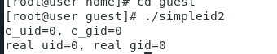

---
# Выполнение

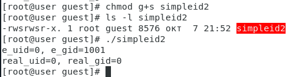{ #fig:008 width=70% }

---
# Выполнение

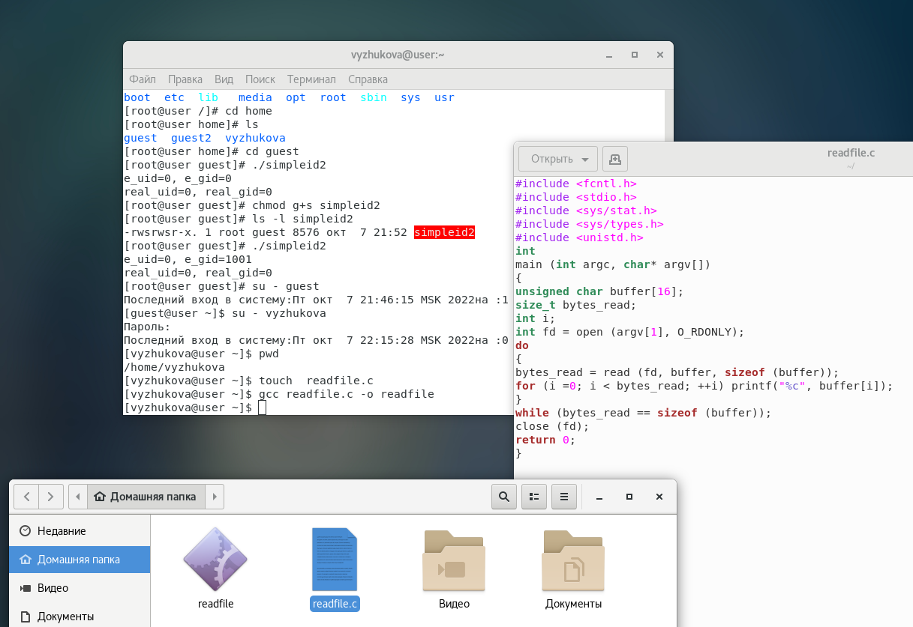

---
# Выполнение

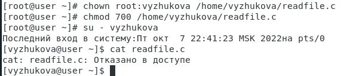

---
# Выполнение
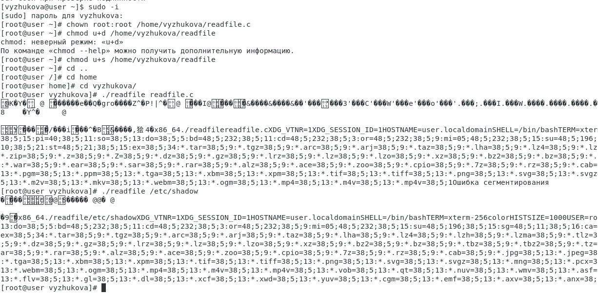

---

# Выполнение

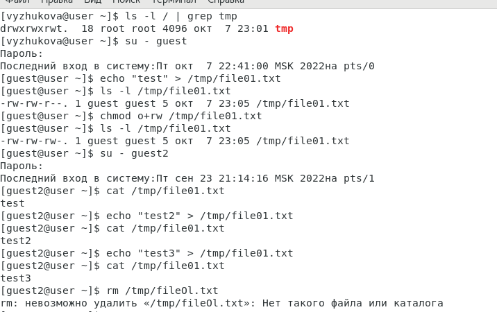

---

# Выполнение

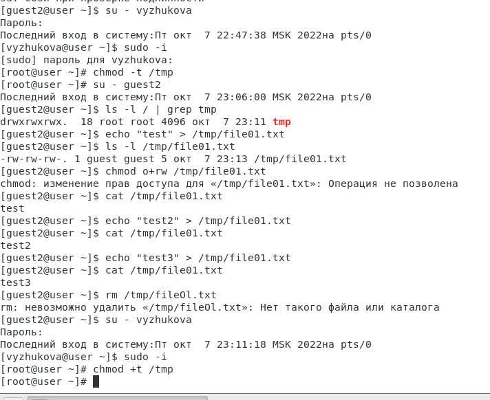

---

# Вывод

Изучила механизмы изменения идентификаторов, применения SetUID- и Sticky-битов. Получила практические навыки работы в консоли с дополнительными атрибутами. Рассмотрела работу механизма смены идентификатора процессов пользователей, а также влияние бита Sticky на запись и удаление файлов.
