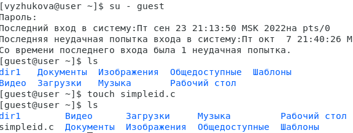
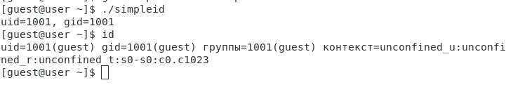
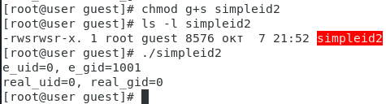
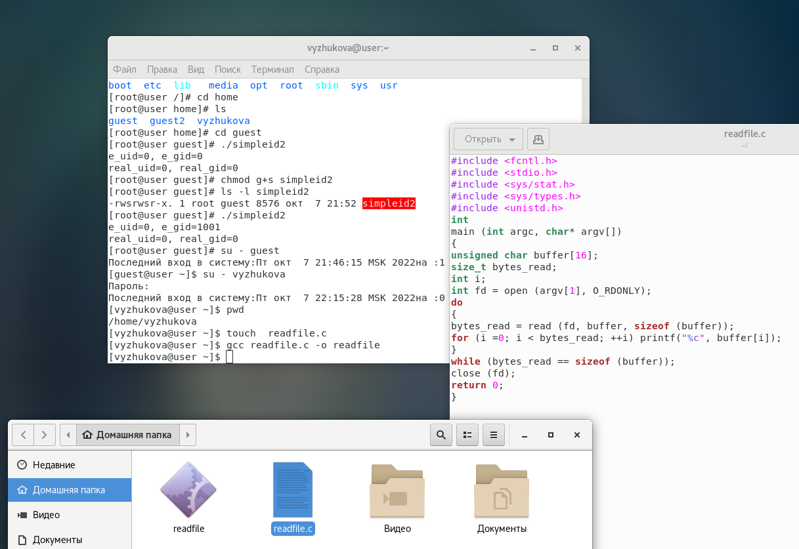
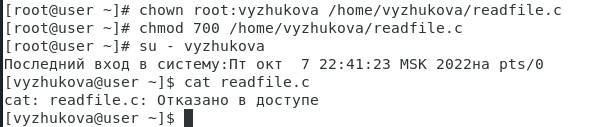
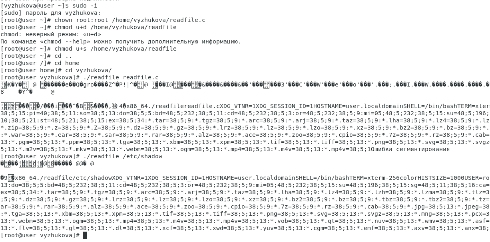
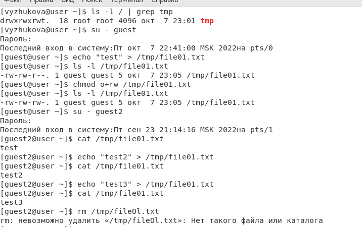

---
# Front matter
lang: ru-RU
title: "Лабораторная работа №5"
subtitle: "Информационная безопасность"
author: "Жукова Виктория"

# Formatting
toc-title: "Содержание"
toc: true # Table of contents
toc_depth: 2
lof: true # List of figures
fontsize: 12pt
linestretch: 1.5
papersize: a4paper
documentclass: scrreprt
polyglossia-lang: russian
polyglossia-otherlangs: english
mainfont: PT Serif
romanfont: PT Serif
sansfont: PT Sans
monofont: PT Mono
mainfontoptions: Ligatures=TeX
romanfontoptions: Ligatures=TeX
sansfontoptions: Ligatures=TeX,Scale=MatchLowercase
monofontoptions: Scale=MatchLowercase
indent: true
pdf-engine: lualatex
header-includes:
  - \linepenalty=10 # the penalty added to the badness of each line within a paragraph (no associated penalty node) Increasing the value makes tex try to have fewer lines in the paragraph.
  - \interlinepenalty=0 # value of the penalty (node) added after each line of a paragraph.
  - \hyphenpenalty=50 # the penalty for line breaking at an automatically inserted hyphen
  - \exhyphenpenalty=50 # the penalty for line breaking at an explicit hyphen
  - \binoppenalty=700 # the penalty for breaking a line at a binary operator
  - \relpenalty=500 # the penalty for breaking a line at a relation
  - \clubpenalty=150 # extra penalty for breaking after first line of a paragraph
  - \widowpenalty=150 # extra penalty for breaking before last line of a paragraph
  - \displaywidowpenalty=50 # extra penalty for breaking before last line before a display math
  - \brokenpenalty=100 # extra penalty for page breaking after a hyphenated line
  - \predisplaypenalty=10000 # penalty for breaking before a display
  - \postdisplaypenalty=0 # penalty for breaking after a display
  - \floatingpenalty = 20000 # penalty for splitting an insertion (can only be split footnote in standard LaTeX)
  - \raggedbottom # or \flushbottom
  - \usepackage{float} # keep figures where there are in the text
  - \floatplacement{figure}{H} # keep figures where there are in the text
---

# Цель работы

Изучение механизмов изменения идентификаторов, применения SetUID- и Sticky-битов. Получение практических навыков работы в консоли с дополнительными атрибутами. Рассмотрение работы механизма смены идентификатора процессов пользователей, а также влияние бита Sticky на запись и удаление файлов.

# Выполнение лабораторной работы

 Вошла в систему от имени пользователя guest, создала программу `simpleid.c`. (рис. -@fig:002)

{ #fig:002 width=70% }

Скомпилировала программу и убедилась, что файл программы создан: `gcc simpleid.c -o simpleid`. Выполнила программу simpleid: `./simpleid`. Выполнил программу `id` и сравнил полученный результат с данными предыдущего пункта задания. Полученные значения id совпадают. (рис. -@fig:003)

{ #fig:003 width=70% }

Усложнила программу, добавив вывод действительных идентификаторов, получившуюися программу назвала `simpleid2.c`. Скомпилировала и запустила simpleid2.c `gcc simpleid2.c -o simpleid2`, а затем `./simpleid2`. (рис. -@fig:005)

{ #fig:005 width=70% }

От имени суперпользователя выполнила команды: `chown root:guest /home/guest/simpleid2`, а затем `chmod u+s /home/guest/simpleid2`. Первая команда изменяет права на файл с guest на root. А затем устанавливает атрибут SetUID, который запускает программу не с правами пользователя, а с правами владельца файла. (рис. -@fig:006)

{ #fig:006 width=70% }

Затем выполнила  проверку изменений с помощью команды `ls -l simpleid2`. 

Запустил simpleid2 и id: `./simpleid2`, `id`. При данном запуску выводы совпадают. (рис. -@fig:007)

{ #fig:007 width=70% }

Проделала то же самое с атрибутом SetGID (установление прав для владеющей группы). Запустила файл. Теперь выводы для группы различны.

{ #fig:008 width=70% }

Создала программу `readfile.c`. Откомпилировала программу: `gcc readfile.c -o readfile`.(рис. -@fig:008) 

{ #fig:008 width=70% }

 Сменила владельца у файла readfile.c и изменила права так, чтобы только суперпользователь(root) мог прочитать его, a vyzhukova не мог. Проверил, что пользователь vyzhukova не может прочитать файл readfile.с (рис. -@fig:009)

{ #fig:009 width=70% }

Сменила у программы readfile владельца и установил SetU’D-бит. Программа readfile может прочитать файл readfile.c. Программа readfile может прочитать файлы /etc/shadow. (рис. -@fig:010)

{ #fig:010 width=70% }

Исследование Sticky-бита. Узнал, установлен ли атрибут Sticky на директории /tmp, для чего выполнил команду `ls -l / | grep tmp` 

От имени пользователя guest создала файл file01.txt в директории /tmp
со словом test `echo "test" > /tmp/file01.txt`. Просмотрела атрибуты у только что созданного файла и разрешила чтение и запись для категории пользователей «все остальные»: `ls -l /tmp/file01.txt`, `chmod o+rw /tmp/file01.txt`, `ls -l /tmp/file01.txt`. От пользователя guest2 (не являющегося владельцем) попробовала прочитать файл /tmp/file01.txt: `cat /tmp/file01.txt`, записать в файл `/tmp/file01.txt` текст test3, стерев при этом всю имеющуюся в файле информацию командой `echo "test3" > /tmp/file01.txt`. Проверила содержимое файла командой `cat /tmp/file01.txt`, попробовала дозаписать в файл `/tmp/file01.txt` слово test2 командой `echo "test2" >> /tmp/file01.txt`, удалить файл /tmp/file01.txt командой `rm /tmp/file01.txt` Файл удалить не удалось. (рис. -@fig:011)

{ #fig:011 width=70% }

Повысил свои права до суперпользователя следующей командой `su -`
и выполнил после этого команду, снимающую атрибут t (Sticky-бит) с
директории /tmp: `chmod -t /tmp`. Затем попробовал выполнить все вышеперечисленные операции. Все удалось. (рис. -@fig:012)
Повысила свои права до суперпользователя и вернула атрибут `t` на директорию /tmp: `su -`, `chmod +t /tmp`, `exit`.

{ #fig:012 width=70% }

# Выводы

Изучила механизмы изменения идентификаторов, применения SetUID- и Sticky-битов. Получила практические навыки работы в консоли с дополнительными атрибутами. Рассмотрела работу механизма смены идентификатора процессов пользователей, а также влияние бита Sticky на запись и удаление файлов.

# Список литературы

1. [КОМАНДА CHATTR В LINUX](https://losst.ru/neizmenyaemye-fajly-v-linux)
2. [chattr](https://en.wikipedia.org/wiki/Chattr)