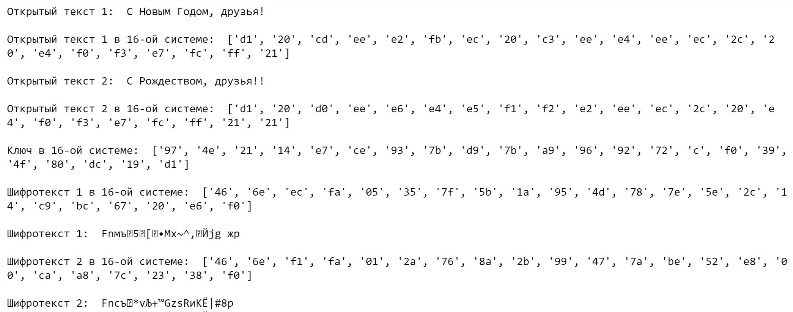
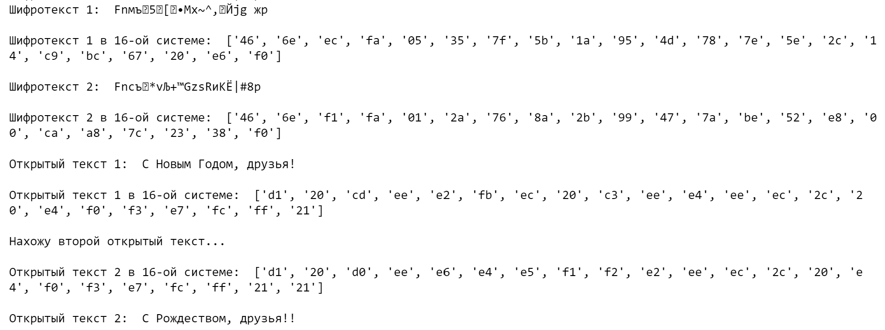

<style>
section::after {
  content: attr(data-marpit-pagination) ' / ' attr(data-marpit-pagination-total);
}
img[alt="center"] {
     display: block;
     margin: 0 auto;
}
h1 {
    font-size: 60px;
    text-align: center;
}
h2 {
    font-size: 30px;
    text-align: left;
    position: relative;
    left: -2em;
    line-height: 0px;
    top: 8em;
}
h3 {
    font-size: 40px;
    text-align: left;
    position: relative;
    left: -0.5em;
    bottom: 0.2em;
}
h4 {
    font-size: 25px;
    text-align: center;
    position: relative;
    left: -0.5em;
    bottom: 0.2em;
}
</style>

# Лабораторная работа №8
## Жукова Виктория
## НКНбд-01-19
## RUDN University, 20 October 2022 Moscow, Russia

--- 

# Элементы криптографии. Шифрование (кодирование) различных исходных текстов одним ключом

---

### Цель выполнения работы

- Освоить на практике применение режима однократного гаммирования на примере кодирования различных исходных текстов одним ключом

---

### Задание

Два текста кодируются одним ключом (однократное гаммирование).

Требуется не зная ключа и не стремясь его определить, прочитать оба текста. Необходимо разработать приложение, позволяющее шифровать и дешифровать тексты $P_1$ и $P_2$ в режиме однократного гаммирования. Приложение должно определить вид шифротекстов $C_1$ и $C_2$ обоих текстов $P_1$ и $P_2$ при известном ключе ; Необходимо определить и выразить аналитически способ, при котором злоумышленник может прочитать оба текста, не зная ключа и не стремясь его определить.

---

# Выполнение работы

---

### Выполнение работы

``` python
import numpy as np
import operator as op
import sys

s1 = "С Новым Годом, друзья!"

s2 = "С Рождеством, друзья!!"

def encryption(text1, text2):
    print("Открытый текст 1: ", text1)
    new_text1 = []
    for i in text1:
        new_text1.append(i.encode("cp1251").hex())
    print("\nОткрытый текст 1 в 16-ой системе: ", new_text1)
    
    print("\nОткрытый текст 2: ", text2)
    new_text2 = []
    for i in text2:
        new_text2.append(i.encode("cp1251").hex())
    print("\nОткрытый текст 2 в 16-ой системе: ", new_text2)
    
    r = np.random.randint(0, 255, len(text1))
    key = [hex(i)[2:] for i in r]
    new_key = []
    for i in key:
            new_key.append(i.encode("cp1251").hex().upper())
    print("\nКлюч в 16-ой системе: ", key)
    
    xor_text1 = []
    for i in range(len(new_text1)):
        xor_text1.append("{:02x}".format(int(key[i], 16) ^ int(new_text1[i], 16)))
    print("\nШифротекст 1 в 16-ой системе: ", xor_text1)
    en_text1 = bytearray.fromhex("".join(xor_text1)).decode("cp1251")
    print("\nШифротекст 1: ", en_text1)
    
    xor_text2 = []
    for i in range(len(new_text2)):
        xor_text2.append("{:02x}".format(int(key[i], 16) ^ int(new_text2[i], 16)))
    print("\nШифротекст 2 в 16-ой системе: ", xor_text2)
    en_text2 = bytearray.fromhex("".join(xor_text2)).decode("cp1251")
    print("\nШифротекст 2: ", en_text2)
    
    return key, xor_text1, en_text1, xor_text2, en_text2
```

---

### Выполнение работы

``` python
def decryption(c1, c2, p1):
    print("Шифротекст 1: ", c1)
    new_c1 = []
    for i in c1:
        new_c1.append(i.encode("cp1251").hex())
    print("\nШифротекст 1 в 16-ой системе: ", new_c1)
    
    print("\nШифротекст 2: ", c2)
    new_c2 = []
    for i in c2:
        new_c2.append(i.encode("cp1251").hex())
    print("\nШифротекст 2 в 16-ой системе: ", new_c2)
    
    print("\nОткрытый текст 1: ", p1)
    new_p1 = []
    for i in p1:
        new_p1.append(i.encode("cp1251").hex())
    print("\nОткрытый текст 1 в 16-ой системе: ", new_p1)
    
    print("\nНахожу второй открытый текст...")
    
    xor_tmp = []
    sp2 = []
    for i in range(len(p1)):
        xor_tmp.append("{:02x}".format(int(new_c1[i], 16) ^ int(new_c2[i], 16)))
        sp2.append("{:02x}".format(int(xor_tmp[i], 16) ^ int(new_p1[i], 16)))
    print("\nОткрытый текст 2 в 16-ой системе: ", sp2)
    
    p2 = bytearray.fromhex("".join(sp2)).decode("cp1251")
    print("\nОткрытый текст 2: ", p2)
    return p2, sp2

k, t1, et1, t2, et2 = encryption(s1, s2)
s3 = decryption(et1, et2, s1)
```

---

### Выполнение работы


#### Рис.1 Вывод функции encryption

---

### Выполнение работы


#### Рис.2 Вывод функции decryption

---

### Выводы

В ходе выполнения данной лабораторной работы я:

- Освоила применение режима однократного гаммирования на примере кодирования различных исходных текстов одним ключом

---

# Спасибо за внимание!